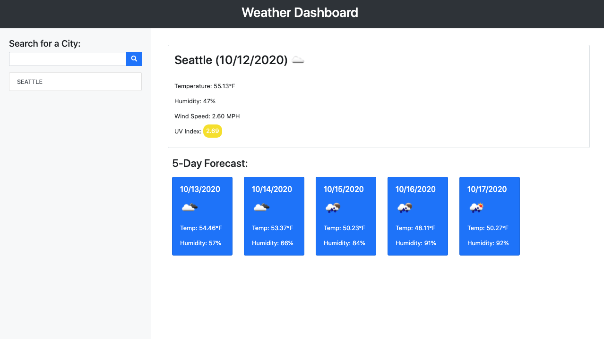

# Weather Dashboard

Explore the [project page](https://github.com/cynthiwu/weather-dashboard)

View it live on [github-pages](https://cynthiwu.github.io/weather-dashboard/)

## Table of Contents
- [About The Project](#about-the-project)
  - [Acceptance Criteria](#acceptance-criteria)
- [Usage](#usage)
  - [Demo](#demo)
- [Built With](#built-with)
- [Contributing](#contributing)
- [Contact](#contact)


## About The Project

The goal of this project was to create a weather dashboard that would allow the user to search and view current and forecasted weather for a given city name. The dashboard has a search input where users can search for targeted cities and save for future reference. The weather display shows weather icons and data for the current time and the 5 day forecast. 

<hr>



<hr>

### Acceptance Criteria

The below were the acceptance criteria for this project:

```
GIVEN a weather dashboard with form inputs
WHEN I search for a city
THEN I am presented with current and future conditions for that city and that city is added to the search history
WHEN I view current weather conditions for that city
THEN I am presented with the city name, the date, an icon representation of weather conditions, the temperature, the humidity, the wind speed, and the UV index
WHEN I view the UV index
THEN I am presented with a color that indicates whether the conditions are favorable, moderate, or severe
WHEN I view future weather conditions for that city
THEN I am presented with a 5-day forecast that displays the date, an icon representation of weather conditions, the temperature, and the humidity
WHEN I click on a city in the search history
THEN I am again presented with current and future conditions for that city
WHEN I open the weather dashboard
THEN I am presented with the last searched city forecast
```

## Usage

This project can be used by anyone who wishes to search for current or future weather forecasts by city name.  

### Demo

Watch the gif below to see how the quiz works. 


## Built With

This project was built using:

* [Bootstrap](https://getbootstrap.com/)
* [Moment.js](https://momentjs.com/)
* [OpenWeather global services](https://openweathermap.org/)
* [jQuery](https://jquery.com/)


## Contact

Cynthia Wu - [@cynthia21wu](https://twitter.com/cynthia21wu) - cynthia21wu@gmail.com

Project Link: [https://github.com/cynthiwu/weather-dashboard](https://github.com/cynthiwu/weather-dashboard)
